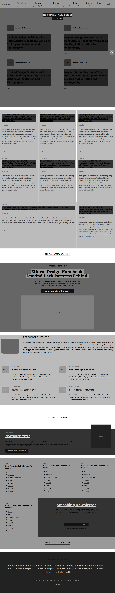

# A heatmap of smashing magazine webpage

> The main aim of this project was to have a clear understanding of visual hierachy.

## Built With

- HTML,
- CSS

## Live Demo

[Live Demo Link](https://rawcdn.githack.com/misterpaul4/heat-map/c578c38c3c778f164274ed729b8aa0761ebf022a/index.html)

## Authors

👤 **Author1**

- Github: [@githubhandle](https://github.com/misterpaul4)
- Twitter: [@twitterhandle](https://twitter.com/paulajuze)
- Linkedin: [linkedin](https://linkedin.com/in/chukwuebuka-paul-ajuizeogu/)

👤 **Author2**

- Github: [@githubhandle](https://github.com/Stricks1)
- Twitter: [@twitterhandle](https://twitter.com/gandhinomethor)
- Linkedin: [linkedin](https://linkedin.com/in/gabriel-malheiros-silveira-b6632061/ )

## 🤝 Contributing

Contributions, issues and feature requests are welcome!

Feel free to check the [issues page](issues/).

## Show your support

Give a ⭐️ if you like this project!

## Acknowledgments

- Hat tip to anyone whose code was used
- Inspiration
- etc

## 📝 License

This project is [MIT](lic.url) licensed.
